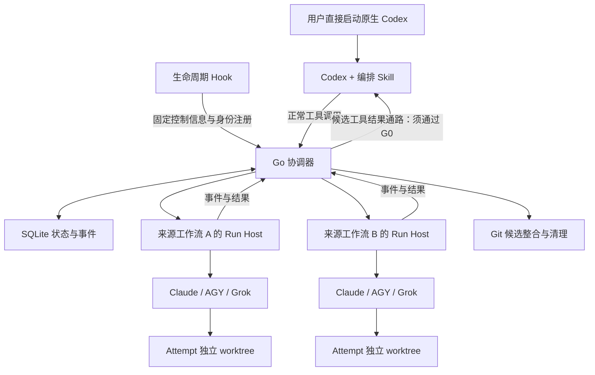

# 原生 Codex CLI 协作工具：v0.1 设计

日期：2026-09-10。

设计过程：GPT-6 Astra、max 推理强度子 Agent 负责架构设计与压力检查；主 Agent 整理需求、核验接口、编写验收矩阵并汇总本文件。

状态：设计提案，经过逐项评审修订后仍须通过可行性原型；未实现程序，未完成原生会话回调或 Windows 端到端验证。下文“必须/不得”是实现与发布条件，不代表已经实现。项目独立实现，不基于此前讨论的第三方仓库。

配套文档：[验收矩阵](acceptance-v0.1.md)、[接口证据与未知项](evidence.md)。

## 1. 产品目标与已确认约束

用户直接运行原生 `codex`，通过自然语言要求主控分派任务。Codex 负责理解需求、方案设计、拆分、选择执行者、处理执行中问题和最终审查。Claude、AGY、Grok 的本地 CLI 负责功能和测试实现。

| 约束 | v0.1 决定 |
|---|---|
| 接入 | 一次性安装 Codex Skill/插件及必要集成配置；不修改 Codex 本体，不提供替代启动入口 |
| 协议 | 不使用 MCP；本地命令和 IPC 负责派发；原生会话回传采用待 G0 验证的候选接口，通过后才准入 |
| 平台与语言 | Go；macOS 和原生 Windows/PowerShell；不依赖 WSL |
| 工作对象 | Git 仓库；明确列出经过验证的 Codex 和执行 CLI 版本 |
| 执行者 | 默认由 Codex 选择，用户可以指定或覆盖 |
| 并发 | 用户级默认总并发 2，可配置；每工作流上限不得超过总上限，避免多会话放大 |
| 依赖 | 独立工作继续；依赖结果的步骤等待声明的产物就绪条件 |
| 回调 | 关键进展、技术问题、失败、完成；本地执行日志经adapter过滤并受额度限制，截断可见，不逐条转发主会话 |
| 问答 | 执行者先问 Codex，主控无法决定或超出原任务范围时再问用户 |
| 重试 | 每任务最多 3 次执行尝试，包含首次；可由 Codex 选择其他 CLI |
| 整合 | 审查通过后自动整合到约定的当前工作分支；不自动 push；保护原有修改 |
| 关闭 | 已派发执行继续，结果持久化；恢复原会话后交回 |
| 生命周期 | 首次派发自动启动后台进程，有任务或待回调时保留，完全空闲后退出；不默认开机常驻 |
| 账号权限 | 工具只负责派发和回收，不接管账号，不改变认证、计费来源或权限 |
| 清理 | 无用临时脚本与文件必须按归属清理；交付物和必要恢复材料保留 |

原生 Codex 可能显示一次正常的工具调用；“不显示命令流”指不向主会话转发执行者逐条命令，不承诺修改或隐藏 Codex 自己的 UI 行为。

## 2. 核心架构



同一个 Go 可执行文件提供多个子命令/进程角色，不需要多套部署服务。下文用 `<tool>` 作为命令占位名，项目名称后定。

| 模块 | 责任与边界 |
|---|---|
| Codex Skill | 语义决策、任务合同、执行者选择、问题回复、审查；不能把账号审批等同于技术决策 |
| 生命周期 Hook | 注册来源身份，报告固定的待取事件标识；快速返回，不运行长期执行任务 |
| 协调器 | 唯一状态写入者；DAG、配额、事件、交付、重试预算和 Git 整合；不自行调用模型 API |
| Run Host | 沿用来源调用的正常环境，拥有 CLI 进程树，记录日志、问题和结果；不决定产品方案 |
| Adapter | 各 CLI 的经过验证的参数、输出、提问、续接、取消与能力差异 |
| 会话连接器 | 精确绑定原 thread，串行回传、对账和确认消费；禁止猜测会话 |
| Git/Artifact/Cleanup | 固定基线、冻结候选、组合验证、当前分支整合与所有权清理 |

协调器执行的是 Codex 已提交的规则；不能把“自动化”实现成隐藏的第二个主控模型。

## 3. 账号、权限与来源环境

### 3.1 不变的边界

- 不读取、复制或修改底层 CLI 的登录文件、token、Keychain 凭据或账号配置。
- 不执行 login/logout；不切换认证模式、API 地址、provider、账号或计费来源。
- 不自动追加绕过审批、扩大权限、关闭沙箱或信任新目录的参数。
- 不收集认证材料，不将继承环境、凭据文件或账号配置转存到任务 DB、日志、事件和快照；日志不启用原生认证调试模式。
- 安装/卸载只操作本项目集成文件和配置条目，保留其他插件与用户设置。
- 底层 CLI 自己读取和刷新凭据属于其正常行为；工具不接管，也不承诺冻结这些内部行为。

权限拒绝独立于技术提问，状态为 `permission_blocked`。主控不能通过切换 CLI 绕过已发生的访问拒绝。认证不可用时可以按已授权任务策略选择另一个本来可用的 CLI，但不能替原 CLI 登录或改账号。

Headless 模式和新 worktree 可能改变目录信任，以及按目录发现的项目/祖先/本地配置、provider、端点和权限来源。Adapter 只允许版本化的启动参数白名单；以底层 CLI 可提供的非凭据有效配置信息或隔离测试夹具验证来源连续性，不复制账号配置到 worktree。没有安全可验证的办法时，该组合不准入，不能追加权限绕过参数让演示通过。

同样约束会话连接器 RPC：initialize 仅传项目 clientInfo 和必要 capability；`turn/start` 的参数白名单为 `{threadId, input: [], toolOutput: {name, namespace?, output}}`，name 非空，不允许非空 input 或复制模型/provider/权限/审批/cwd 等 sticky 设置。需要原生 resume 时，只能使用经过验证且不会覆写有效设置的最小参数，不替原生客户端回答权限请求。

CLI 的任意输出可能包含未知秘密，因此“不收集认证材料”不能写成“能识别并消除任意秘密”的保证。默认只持久化 adapter 按 schema 选出的任务事件、允许字段和报告，排除已知敏感字段；未知原始行不无条件写盘，只记录解析失败计数/阶段。自由文本任务结果仍是用户任务数据，模型和用户不应在其中放入认证材料。保密边界无法建立的认证调试模式不支持；不给 raw 日志开关偷偷改变这一边界。

### 3.2 环境不能跨会话复用

长期协调器的环境可能来自最早的 Codex 会话。后续会话的 PATH、CLI 版本和认证环境可能不同，不能让它们全部继承协调器的最初环境。

`<tool> submit` 从来源调用环境启动一个按工作流复用的 Run Host；宿主通过操作系统正常继承环境，协调器仅发送调度命令，不接收或序列化认证环境。该上下文在绑定时固定；用户后续环境变更需明确重新绑定，旧宿主不自动替新来源启动任务。

Run Host 活着时可启动排队任务和续接。宿主丢失或机器重启后，如果无法不保存凭据地重建环境，进入 `launch_context_unavailable`，等待原会话恢复重新绑定，不能回退到其他会话的环境。

执行者进程使用既有 CLI 的正常权限。任务级 IPC 只授予本次 attempt 的报告能力，不授予认可结果、整合、调度其他任务或更改权限的能力。

## 4. 原生会话绑定与回调

### 4.1 已有依据与未解决部分

官方 App Server 支持 `turn/start.toolOutput`，本地 0.153.4 schema 也存在该字段。官方文档说明，普通轮次活跃时外部工具输出会排队。[官方接口](https://learn.chatgpt.com/docs/app-server#start-a-turn)

这不证明普通 `codex` 启动后必然能被第三方准确连接，也不证明终端关闭与恢复语义。必须先完成 G0。

Hooks 可提供身份/生命周期信息，但异步 Hook 本身不能唤醒空闲会话，而且会话结束会取消尚未结束的后台 Hook。因此不能把它当长期执行宿主。[官方 Hooks](https://learn.chatgpt.com/docs/hooks)

### 4.2 身份与状态

每个工作流至少记录：

```text
repo_id / run_id / controller_thread_id
session_tree_id（仅关联）
origin_instance_id / origin_process_identity
controller_epoch / delivery_endpoint_identity
```

- `Thread.id` 才是具体会话路由目标；`Thread.sessionId` 是 session tree 共享标识。主控可以是在 fork 中发起工作流的当前 thread，不得强制路由到 session tree 根。
- Hook 的 `session_id` 如何映射到主控 thread 必须实测；子 Agent Hook 不注册或抢占主控。Hook 父进程可能是共享 daemon，不能当作 TUI 进程。
- 仓库身份基于规范化的 Git common-dir，而不是仅用 cwd 字符串。
- PID 要与创建时间等身份信息组合，防止进程号复用。
- `controller_epoch` 废止旧会话实例的控制请求。
- 必须连接真正承载该原生会话的服务；新开一个 app-server 读取同一份历史不算原会话回调。

内部状态区分 `bound_unknown`、`attached_idle`、`attached_busy`、`detached`、`delivery_uncertain`、`owner_conflict`。`loaded`、进程存活、`canAcceptDirectInput` 均不能单独证明用户界面在线；`bound_unknown` 不允许自动唤醒。

多个客户端打开同一 thread 时仍只允许一个交付者；不采用“最近活跃者获胜”。控制权不明确时保留结果，执行任务继续，新的主控决策等待明确归属。

安装/升级后检查原生 Hook 信任状态；未信任、被禁用或策略禁止时，在启动任务前报告不可用。使用 Codex 正常 `/hooks` 审阅流程，不静默批准 Hook。具体来源绑定、原服务证明、在线失效和实验步骤见 [G0 实验规格](g0-validation-plan.md)。

### 4.3 保留执行者结果的身份

实际执行结果优先通过待 G0 验证的 `toolOutput` 路径返回；Codex 主动调用 `collect` 可读取同一事件，但它不能替代空闲自动回调的准入条件。执行者原文不能放入 Hook 的 developer context，也不能变成代表用户授权的新提示。

Hook 只返回固定的本工具控制信息，例如绑定标识和待取事件 ID。`codex queue` 不是当前已确定的正式替代方案；不能在 toolOutput 通路失败后静默用伪装用户输入的方式替代。

不会修改聊天历史、模拟键盘、构造伪造 assistant/developer 消息或新建同名主控。

### 4.4 交付去重与并发边界

每个 thread 一个交付者，同一时刻一个运输状态未确定的在途批次；交付者的本地互斥受协调器 OS 单实例锁和 epoch 约束。租约过期不能使一个仍可发送的旧 socket 自动失效：交接前必须停止旧发送者并确认旧请求状态，不确定则暂缓。短时多个结果可合并，问题和失败优先，普通心跳不送模型。

```text
pending → sending → transport_accepted
                    → history_confirmed → controller_acked
             ↘ delivery_uncertain
```

- RPC 接收不等于模型处理完成，JSON-RPC request ID 不是业务幂等键。
- 发送前持久化不可变 delivery ID、目标 thread/epoch、有序事件版本及 payload hash，并置于 toolOutput envelope 中；回执记录原生 turn/item 标识供对账。
- `collect` 不自动把所有事件标记为处理完成；Codex 逐事件提交 `handled / waiting_user / stale / rejected` 处置。ACK 与决定、待执行副作用意图在同一事务提交。
- ACK 丢失先对账，不无条件重发创建新轮次。
- 对账分为精确标记与 hash 已存在、已证明未接收、无法判断；历史查不到不等于未接收，需排除在途旧请求与原生待处理队列、分页/压缩遗漏。
- 即使底层无法保证重复展示绝对为零，也要保证不重复派发、回答、重试或整合。
- G0 必须验证是否有足够的原生历史/通知信息完成对账；不足时不能声称可靠自动投递已实现。

运输已得到原生权威对账后即可释放发送槽，业务 ACK 继续单独等待，避免未 ACK 的普通进展挡住后来问题；运输仍 uncertain 时不盲目发送下一批。真实忙闲切换由原服务处理，连接器不凭一次状态读取并行创建多个轮次。

“检查在线”与“发送结果”之间存在关闭竞态。建议以原会话服务确认接收为交付提交边界：提交前确认离线则保留；提交后关闭不伪称仍能撤回已接收输入。若要保证关闭瞬间绝不启动一次轮次，需要原生接口提供更强的条件接收能力，外围程序无法单方面保证。

## 5. 持久化与执行状态机

SQLite 保存小型结构化状态，经过 adapter 过滤的日志、patch、测试报告存文件。协调器是 DB 唯一写入者；Run Host 在协调器离线时写自己的持久化事件 spool，恢复后重放。事务和文件记录的断电/磁盘满边界、单实例及启动账本见 [运行协议](runtime-protocols.md)，不能将“已写入用户态缓冲”当成已提交。

| 实体 | 核心内容 |
|---|---|
| Run | 目标、控制会话、计划版本、目标分支、并发和预算 |
| Task | 验收合同、允许范围、固定基线、依赖产物和执行者策略 |
| Attempt / Segment | 次数、CLI、worktree、执行世代、段 ID、宿主/进程身份、预算和持久化启动状态 |
| Event / Question | 事件序号、问题 ID、任务版本、回答和处理状态 |
| Delivery | 批次、发送状态、服务确认、主控 ACK |
| Artifact / Review | 候选树或提交摘要、报告摘要、审查决定、依赖引用 |
| CleanupEntry | 创建归属、用途、保留原因、文件身份和清理状态 |

有副作用的命令包含 `command_id + controller_epoch + expected_revision`，但调用方可生成新 UUID，因此这只能做请求去重。协调器另以来源事件/问题/候选、目标 revision 和 action slot 派生语义决策键，在事务唯一约束下只允许一次决定；显式修订计划/改变答案需走新 revision，不能换 UUID 绕过。执行事件包含 `run_id + task_id + attempt_id + segment_id + execution_epoch + event_id + sequence`。同 ID 同内容返回旧结果，同 ID 不同内容报冲突；旧 attempt 事件只存档，不推进新 attempt。

```text
draft → queued → ready → running → result_ready → reviewing → accepted
                         ↕ waiting_decision                 ↘ rework
                         ↘ permission_blocked
                         ↘ retry_pending / failed / cancelled
accepted → integrating → integrated → cleaning → completed
                                       ↘ cleanup_pending
```

这是用户任务状态的概览，数据库分别维护 task、attempt、review、delivery 和 cleanup 状态，避免把所有正交状态塞进一个枚举。

启动前持久化派发意图和并发占用，再发送幂等启动请求。进程创建与数据库事务不具备跨系统原子性，“启动已发生但 ACK 丢失”必须进入可对账状态，不能直接再启动一次。

提交计划先验证依赖环、缺失节点、产物版本和范围冲突；等待原因、失败传播、计划 revision、全局公平配额均有明确规则。改变依赖不会隐式改变正在运行任务的基线；详见运行协议。`completed` 同时要求业务交付、必要事件处理以及无未解决的临时产物清理项，不以任一单表状态推断。

## 6. 粒度、进展、超时与重试

### 6.1 按成果拆分

每个任务应有可独立验收的目标，而不是固定文件数、函数数或机械时长。任务合同包含：目标/非目标、修改范围、依赖版本、验收方式、阶段检查点、预计耗时、允许静默的阶段、问题触发条件和预算。

“整个登录系统”通常过大，“修改一个标点”通常无须单独委派。合适的单元可以是“登录接口及相应测试”；后续依赖它的客户端接入单独执行。

复杂度上升时，执行者报告范围变化和建议检查点，由 Codex 决定拆分。简单任务只派一个执行者，不为凑满并发而拆分。

常规任务可先以约 10–30 分钟的可验收单元作规划参考；这是待实测校准的估计，不是失败判据或固定拆分规则。

### 6.2 三种时间信号

| 信号 | 说明 |
|---|---|
| last_liveness | 宿主/进程仍然可见，仅证明存活 |
| last_activity | 有日志、工具或文件活动，不一定推进目标 |
| last_progress | 有可说明的阶段成果，并标注执行者自报或运行器确认 |

重复日志、心跳、文件 mtime 变化不能假装成实质进展。向用户汇报最近真实阶段；没有可靠新信息就明确没有新进展。

建议静默约 5 分钟触发一次低成本诊断，超过阶段预算触发关注事件；这些是可配置的初始提案，不能直接导致重试。长测试、下载等按任务合同显示状态。

硬上限由计划明确指定并写入 Host 的执行账本；初始默认每 attempt 活跃执行 60 分钟、每任务累计 120 分钟，可在派发前按任务调整。到达时 Host 即使协调器离线也执行停止协议，确认退出后标记 `budget_exhausted`；停止不确定则保留 UNKNOWN，不提前重试。此标记不是“已证明假死”。排队、等待主控/用户答复和实际执行分别计时；分段续接累计活跃执行时间，不通过续接无限重置预算。

等待答复但 CLI 执行树仍活着时仍占执行槽，v0.1 不提供“OS 暂停后释放配额”。仅确认整棵已拥有执行树退出才释放；问答通过退出当前段再续接，续接必须重新获得槽。UNKNOWN 仍占槽。Run Host 自身不计入执行 CLI 数，但要计入资源测量。

### 6.3 有限恢复

每个 task 最多 3 个 attempt，包括首次。技术问答正常续接属于同一 attempt；业务失败和审查返工消耗新的尝试。瞬时错误只按 Codex 预先明确的策略自动退避；不明错误先让 Codex 判断。

换执行者前确认旧执行树停止并封存结果。每个写 attempt 使用新 worktree，需要继承已有工作时引用冻结产物，不能让新旧执行者共同写一个目录。

用户撤回或取消后，晚到事件不能重新启动该任务、触发整合或唤醒已撤回的工作流。

## 7. 执行者提问与适配器

建议统一接口：`Probe / Start / ReadEvents / ResumeWithAnswer / Cancel / CollectResult`。`Probe` 默认只检查本地版本/帮助/无模型能力，不自动登录或发起收费探测。

事件可来自原生结构化输出，或本工具的任务级辅助命令：

```text
<tool> worker report
<tool> worker ask
<tool> worker result
```

命令通过 stdin 接收结构化数据，只关联当前 attempt。其执行也必须遵守原 CLI 权限；若现有权限不允许事件通道，则报告该适配组合不支持，不能绕过限制。

核心事件类型：`milestone`、`question`、`failure`、`result`。正式结果区分完成/部分完成/阻塞，携带产物位置、测试报告和未完成项，不只返回一段“已完成”的文本。IPC 验证本机来源和 attempt 级能力，限制消息大小与允许动作；能力不是 CLI 账号凭据，不授予操作其他任务的权限。安全边界是避免误投递/错误调用，不宣称能隔离具有同用户完整权限的恶意进程。

v0.1 不要求每个 CLI 都能中途插入输入，可采用分段协议：提交问题并结束当前段，保存 question ID 和 CLI 会话 ID，主控回答后通过已验证的 resume 续接。没有可靠 resume 时，可以用完整交接材料开启新段，但必须明确这是重建上下文而非恢复原模型会话。

每个 adapter 建立操作系统×CLI 版本能力矩阵；不能因为同样有 `-p` 参数就假定权限、问答、取消和输出语义相同。

## 8. 跨平台进程管理

Run Host 与原 Codex/终端生命周期分离，协调器崩溃时仍可记录执行结果。stdout/stderr 持续排空，通过有界缓冲供 adapter 过滤，默认不原样落盘；过滤后事件写 spool，不依赖协调器持续在线。输出超限、解析失败或截断必须显式记录。

- macOS：验证宿主脱离终端生命周期；每个 segment 建立可识别的进程组及启动屏障。进程组不是所有后代的永久容器，后代自行 setsid/守护化的行为不在通用保证内；adapter 必须验证不会逃逸。检测到存活写入者不能确认归属时停止自动恢复与清理。
- Windows：使用 `CREATE_SUSPENDED → AssignProcessToJobObject → 持久登记 → ResumeThread` 处理启动窗口；每个 segment 的 Job 由 Host 独占句柄，采用经验证的关闭句柄终止策略，禁止句柄意外继承。Host 崩溃则 Job 内进程停止，正常 Codex 退出则独立 Host 继续；嵌套 Job/原限制不允许时准入失败，不自动 breakaway 绕过。分别验证 `.exe`、`.cmd`、`.ps1`、空格/中文路径及 PowerShell 关闭。[Job Objects](https://learn.microsoft.com/en-us/windows/win32/procthread/job-objects)
- 不为后台运行而绕过原生 sandbox 或 Job 限制。继承的限制是否允许目标生命周期，属于平台准入实验。
- 宿主崩溃后无法确认旧进程树归属，进入 `orphaned_unknown`；不猜 PID，也不启动第二个写入者。
- 机器重启不承诺模型执行无缝继续；保存任务与现场，确认旧执行已停止及来源环境可恢复后再决定续接。

活动 Host 在协调器 IPC 断开后按有限退避调用同一 `ensure-running` 路径；由 OS 单实例锁决定谁可启动协调器。Hook/submit/collect 也使用该路径。恢复只重放 durable 事件，不重建未知执行或借其他来源环境启动 CLI；协调器启动时不持久化继承环境。退避耗尽则保留 spool 并报告 `coordinator_unavailable`。

资源预算与压力方法见运行协议：分别测量协调器、Run Host 和外部 CLI；完全空闲 30 秒防抖后退出；离线待回调保留时阻塞等待，不忙轮询、不反复调用模型。不能把无限重试清理或频繁启动子进程算作“空闲”。

## 9. Git 基线、依赖、审查与自动整合

### 9.1 输入基线

每个 attempt 绑定不可变 `base_commit` 和依赖产物摘要，不能默认读取不断变化的依赖分支 HEAD。依赖释放依据 Codex 的明确认可或预授权的客观验收条件，不能只依据退出码 0。

派发时记录主分支、HEAD、index 与工作树状态。不自动 stash/reset/清理原文件。若任务依赖尚未提交的修改，不能默默从旧 HEAD 开始：首版优先暂停并让主控明确基线；未提交内容快照可后续实现，但必须另测独立 index、并发编辑和用户文件保护。

不依赖未提交修改的任务可以基于明确提交继续执行，但是否可整合仍取决于目标状态。

### 9.2 候选冻结与组合验证

执行结束后先完成临时产物分类与清理，再冻结候选版本。Review 绑定候选树/提交摘要及报告摘要。审查后改代码、改变依赖或更换基线，旧审查必须失效。

一个仓库只有一个整合流程。候选冲突解决交给执行者任务，协调器不自行修改业务代码。在 integration worktree 中串行组合后重新冻结最终 candidate；必须由 Codex 审查这个最终 candidate，而非仅复用各任务审查。审查绑定最终 commit/tree、目标 base、依赖版本和组合验证报告。各任务独立通过不能替代最终审查和组合验证。

### 9.3 保留已确认的当前分支整合行为

integration worktree/临时交付分支是准备区，不改变“审查通过后自动整合当前工作分支”的目标。

首版目标必须为约定 worktree 中附着的同一分支，HEAD 等于冻结 target base，且 index/已跟踪工作树干净；未跟踪和 ignored 文件对候选写入路径无冲突。提交前 Codex 确认本工具管理的写入者已让出该目标。未提交输入、子模块/稀疏检出等特殊状态按 [Git 与清理协议](git-cleanup-protocol.md) 的显式边界处理，不静默忽略。

持久化整合意图后，使用正常 Git 工作树更新路径：`git merge --ff-only --no-autostash --no-overwrite-ignore <candidate-oid>`；不使用 update-ref 代替 checkout 工作树更新，不 reset、不 stash、不 push。不能省略后两个标志：Git 配置可自动 stash，而 merge 默认会覆盖 ignored 文件。[Git merge 文档](https://git-scm.com/docs/git-merge)

更新后对账实际分支、HEAD、index/tree、验证及 hook 结果。目标漂移或检查不满足时保留候选并暂停；中途崩溃/外部修改导致的 `integration_uncertain` 不自动回滚，不因 DB 租约过期启动另一个 merge。

仓库锁只协调本工具，不能锁住外部编辑器；Git merge 没有跨分支、ref、index、文件的全局 CAS。预检查后的外部 checkout/写入仍可能竞争，事后检测不等于从未修改。v0.1 自动整合的支持条件是已让出且稳定的目标工作区；确定性竞态测试必须验证可观测、保全和停止自动动作，不宣称对任意外部并发写入有原子保证。

## 10. 临时文件与清理

持久状态分别放入 macOS `~/Library/Application Support/<tool>`、Windows `%LOCALAPPDATA%/<tool>`（原生目录发现，不自行拼接环境值）；这些不是 TempDir/UserCacheDir。执行产物放在该持久根，避免在仓库根散落调度文件：

```text
<user-data>/<tool>/
  state.db
  runs/<run>/tasks/<task>/attempts/<attempt>/
    worktree/
    scripts/
    docs/
    data/
    tmp/
```

路径按用途组织。创建前写 durable 创建意图，实际创建后登记文件身份/摘要和用途；崩溃后的半成品按意图对账，无法证实归属则保留。执行者新增文件在候选审核时按全量存量清单分类，包含 ignored 内容，不能只用普通 git status。记录创建者、attempt、路径/文件身份、用途、版本、保留原因、依赖引用和清理状态。

分类：

| 类型 | 处理 |
|---|---|
| 功能代码、正式测试、用户要求的脚本 | 交付并保留 |
| 一次性脚本、探针、中间文件 | 不再需要时删除 |
| 验证报告、必要日志、失败恢复材料 | 在工具数据目录按保留策略保存，解决后回收 |
| 归属不明、内容被他人更改 | 不自动删除，报告主控 |

清理过程：确认写入者停止 → 保存必要证据 → 删除无用临时文件 → 冻结候选 → 审查与整合 → 依赖解除后回收 worktree/临时引用。

不能跟随 symlink/junction 越过管理根；删除时基于目录句柄/不跟随链接的文件身份重查，不能仅检查一次字符串路径。先写删除意图，再操作并对账。Windows 文件占用有限重试，失败持久化为 `cleanup_pending`，到期由主控处理，不无限重试。

worktree 回收前扫描全部内容（包括 ignored），未分类或被他人改动的文件阻止整棵目录删除；普通 git status 为空、worktree remove 不带 force 都不证明安全。只回收本项目登记的 worktree 和固定 OID 私有 refs；refs 删除使用 expected OID，禁止全仓 prune、通配分支删除或全局 git clean。详细恢复和保留策略见 Git 与清理协议。

待回调结果、未解决问题和失败恢复现场不能因 CLI 退出而立即删除。最终回执包含 `removed / retained / cleanup_pending`；清理未完成就不能宣称全部完成。若清理改变了行为相关内容，重新运行相关验证并重新冻结候选。

## 11. 实施阶段与发布门槛

| 阶段 | 工作 | 出口条件 |
|---|---|---|
| G0 | 最小原生会话连接器和模拟事件 | 精确绑定、忙闲回调、角色语义、关闭恢复、交付对账在两平台成立 |
| G1 | 状态机、Run Host、模拟 CLI、故障注入 | 并发、依赖、事件幂等、进程所有权、崩溃恢复成立 |
| G2 | Claude/AGY/Grok adapters | 在现有认证/权限下，各平台验证首次执行、提问、续接、失败与取消 |
| G3 | worktree、review、整合、cleanup | 保护原修改、处理目标漂移、组合验证、清理恢复成立 |
| G4 | 安装卸载、版本矩阵、资源测量 | 两平台安装产物和端到端流程通过，记录实际 CPU/RSS/磁盘开销 |

G0 是产品可行性先决条件，其可执行步骤、故障屏障和证据格式见 [G0 实验规格](g0-validation-plan.md)。若不成立，可以继续开发通用调度组件，但不能将其发布为满足本需求的 v0.1，也不能以新启动器、手动继续或新开主控静默替代。

0.153.4 只是首个候选 Codex 验证版本；最低支持版本必须由实测结果决定。Go 可交叉构建不等于各 CLI 在 Windows 可用，发布支持矩阵必须包含真实平台验证。

首版只做一个 Go 核心、一套本地持久化、一个 Codex 集成包和三个 CLI 适配器。不加入 Web 控制台、云调度、额外模型 API 层和任意执行者市场。

## 12. 需要原型给出答案的问题

1. 普通 `codex` 启动后，如何准确获得原服务端点和 controller thread，包括从 fork 发起的工作流？
2. 是否有足以区分 CLI 界面在线、后台 loaded 和断开的信号？
3. 空闲时 toolOutput 是否能以正确身份自动继续原会话？
4. RPC 已接受但 ACK 丢失时能否可靠对账？关闭瞬间的提交语义是否满足体验？
5. 多客户端和用户新输入同时发生时，能否保持唯一交付者与正确顺序？
6. Windows Job/sandbox 和底层 CLI 既有权限是否允许目标后台生命周期？
7. 各 CLI 的新 worktree、headless、辅助报告命令与 resume 能力是否在不变更账号权限的前提下成立？

本设计不将这些问题伪装成已实现功能。具体判据见配套验收矩阵。未发现新的产品偏好问题前，下一步应先做 G0，而不是继续扩展需求或开发完整调度框架。
